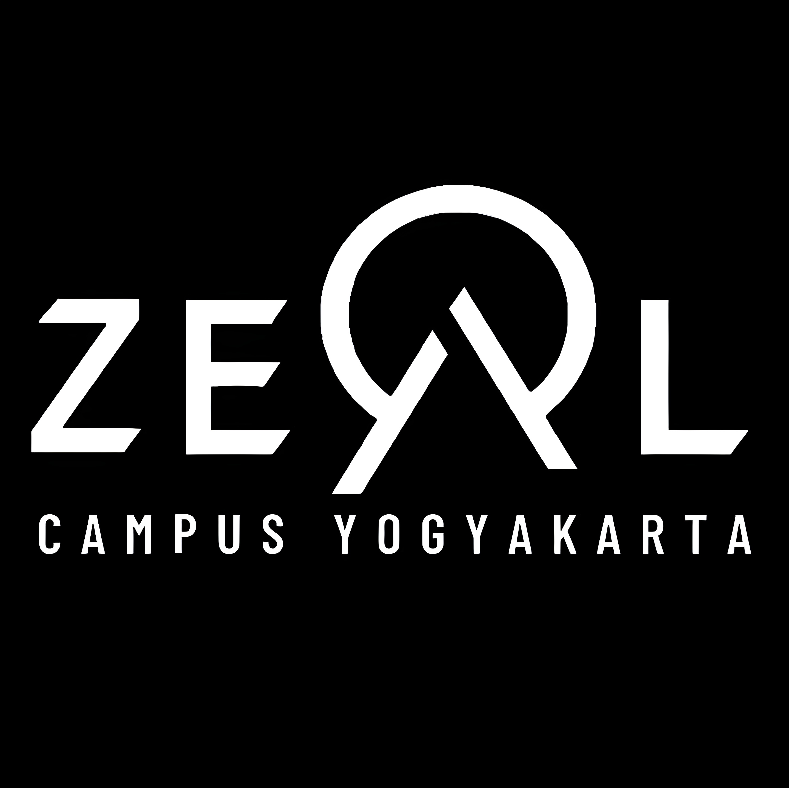
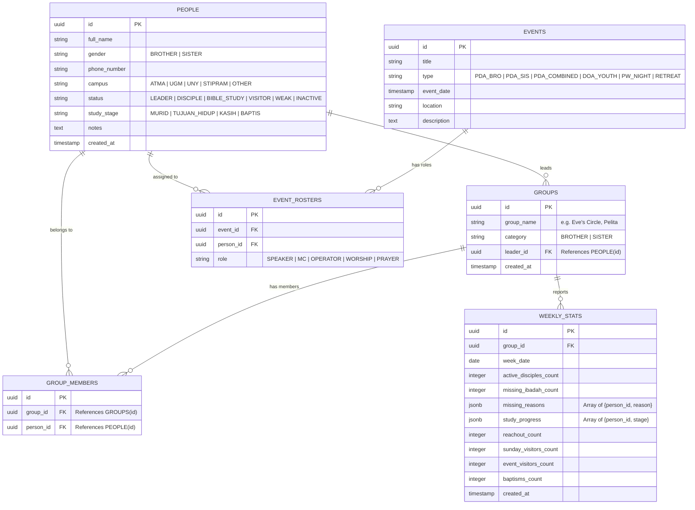

# Product Requirement Document (PRD): Tugu Leadership Portal



## 1. Overview & Vision
**Product Name:** Tugu Leadership Portal (ZEAL Youth & Campus Ministry — GKDI Jogja)  
**Target Audience:** Tugu Leaders / Small Group Leaders (PDG Leaders & Coordinators)  
**Deployment & Database:** Vercel (Hosting) + Supabase (PostgreSQL Database)  
**Branding:** High-contrast monochrome black & white sleek dark mode, centered around the official ZEAL logo.

---

## 2. Key Objectives & Architecture

### Core Purpose
Rebranding from "Pilar" to **"Tugu"**, this platform serves as the central hub for ZEAL leaders in Jogja to manage people (*Tambah Orang*), build small groups (*PDG Groups*), assign group leaders and members, record weekly statistics (*Statistika Minggu*), export WhatsApp reports, and coordinate events.

---

## 3. Data Architecture & Database Schema (Supabase PostgreSQL)



---

## 4. Detailed Module Requirements

### Module 1: People Management — *Tambah Orang* (`/people`)
* **Add / Edit Person Form:**
  * Full Name, Gender (Brother / Sister), Phone / WhatsApp, Campus / University.
  * Status Badge: `Leader`, `Active Disciple`, `Bible Study` (with custom study stage input), `Visitor`, `Weak / Needs Care`, `Inactive`.
  * Personal notes (e.g. OJT schedule, health concerns, prayer requests).
* **People Table & Directory:**
  * Search, filter by gender, campus, status, or small group assignment.
  * Quick status toggle & edit modal.

### Module 2: Small Group Management — *Groups* (`/groups`)
* **Create & Configure Group:**
  * Group Name (e.g. *Eve's Circle*, *Pelita*, *Grace Bloom*, *Ayam Bumbu Hitam*, *One Way*, *Hosea*).
  * Category: Brother Group or Sister Group.
  * Assign Group Leader: Select from active `PEOPLE` tagged as `Leader` or `Disciple`.
* **Member Assignment:**
  * Multiselect interface to assign members from `PEOPLE` to the group.
  * View current group roster, leader contact, and total member count.

### Module 3: Weekly Statistics Engine — *Statistika Minggu* (`/statistika`)
* **Group Selection & Auto-Roster:**
  * Leader selects their Group -> System automatically pulls the active members assigned to that group!
* **Attendance & Study Check-in:**
  * Mark attendance per assigned member (Present / Missing + Reason: Out of town, Sick, OJT, Exams).
  * Update study progress per member (e.g., *Axel - Murid*, *Sherly - Tujuan Hidup*).
  * Key in reachouts, Sunday visitors, event visitors, and baptisms.
* **1-Click WhatsApp Exporter:**
  * Automatically generates formatted WhatsApp report text matching exact ZEAL standards:
    ```text
    STATISTIK MINGGU, [DATE]
    >Nama Grups : Eve's Circle
    * Jlh Disciple : 7
    * Missing Ibadah/reason : 1 (Fina - weak)
    * Jlh Study/progres: 1 (Sherly - Tujuan Hidup)
    * Jlh Reachout : 2
    * Visitor ibadah : 1 (Tia)
    * Visitor acara : 0
    * Jlh Baptis : 0
    ```
* **Dashboard Summary:** Real-time analytics charts saved directly to Supabase.

### Module 4: Activity & Event Planner (`/events`)
* **Event Creation:** PDA Thursday schedules (Bro/Sis/Combined), Doa Bersama Youth, Praise & Worship, Retreats.
* **Duty Roster:** Assign PICs for Speaker, MC, Operator (slides/breakout), Worship Leader.
* **Voting Polls:** Voting on dates/locations for combined events.

### Module 5: Leadership Hub (`/announcements`)
* **Vision & Pinned Directives:** Directives from Babeh (Om Hendra) and BPC leaders.
* **Devotional & Tithe Reminders:** Micro-checkins for daily Quiet Time (*Saat Teduh*) and monthly tithe (*perpuluhan*) tracking.

---

## 5. Technology Stack & Deployment Strategy

* **Framework:** Next.js (App Router, TypeScript / React, Tailwind CSS / Vanilla CSS).
* **Database:** Supabase PostgreSQL with client API (`@supabase/supabase-js`).
* **Hosting / Deployment:** Vercel (Connected to GitHub repository).
* **Styling & Assets:**
  * Black & White High-Contrast Theme featuring the official ZEAL Logo (`4x_zoom.jpg`).
  * Glassmorphic containers, monochrome badge pills, responsive mobile drawer navigation.

---

## 6. Implementation Plan

1. **Next.js Project Initialization:** Set up Next.js app in `./` with Supabase client configuration.
2. **Database Setup (Supabase SQL):** Execute DDL scripts for `people`, `groups`, `group_members`, `weekly_stats`, `events`, `event_rosters`.
3. **UI Design & Layout:** Implement dark monochrome theme incorporating ZEAL logo, sidebar/bottom nav.
4. **Build Core Modules:**
   - People Directory (`/people` — *Tambah Orang*)
   - Group Management & Member Assignment (`/groups`)
   - Weekly Statistics Form & WhatsApp Generator (`/statistika`)
   - Event Calendar & Duty Roster (`/events`)
5. **Vercel Deployment Setup:** Prepare environment variables and build configuration.
